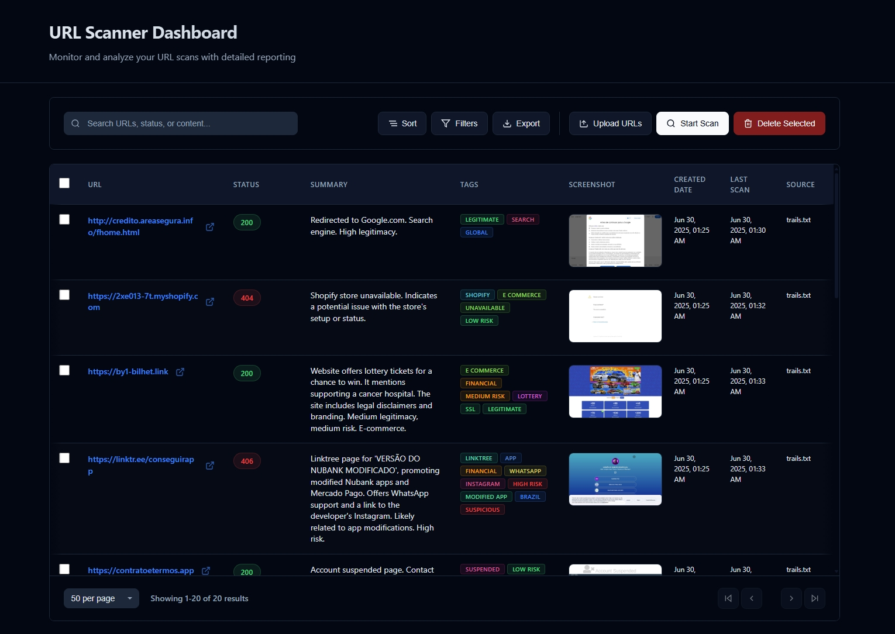

# 🔍 Alive URL Scan

> **A tool I built to automate URL threat analysis using AI**

Tired of manually checking suspicious URLs from phishing feeds? I created this automation tool that combines **n8n workflows**, **AI analysis**, and **automated screenshots** to do the heavy lifting for you. It's a personal project for my portfolio, but I hope it helps other cybersecurity folks speed up their URL analysis workflows.



[](https://docker.com) [](https://ai.google.dev) [](https://n8n.io) [](https://supabase.com) [](LICENSE)

## 🎯 The Problem I'm Solving

After spending way too much time manually analyzing suspicious URLs, I realized we all face the same frustrations:

- **⏰ Manual analysis is slow** - Checking URLs one by one eats up your entire day
- **🎯 Easy to miss the sneaky stuff** - Sophisticated phishing slips past basic keyword filters
- **📊 Drowning in data** - Thousands of URLs from feeds with no good way to prioritize  
- **🔄 Repetitive workflows** - Same steps over and over for every URL
- **🔍 Keywords aren't enough** - You need to understand context, not just match patterns

## 💡 What I Built

So I built **Alive URL Scan** to automate all the tedious stuff:

✨ **AI Does the Analysis** - Google Gemini LLM actually understands what websites are trying to do  
🤖 **Workflows Handle Everything** - n8n orchestrates the entire pipeline automatically  
📸 **Screenshots for Evidence** - Playwright grabs visual proof of what you found  
🐳 **Easy Setup** - Just run `docker compose up -d` and you're analyzing URLs  
🔄 **Scales When Needed** - Queue system handles hundreds of URLs without breaking  

## 👥 Who Might Find This Useful

If you're dealing with suspicious URLs regularly, this might help:

- **🛡️ Security Analysts** - Stop clicking through URLs manually 
- **🕵️ OSINT Folks** - Collect screenshots and evidence automatically  
- **📡 Threat Intel Teams** - Process large feeds without losing your mind
- **🎣 Phishing Hunters** - Spot brand impersonation and targeted attacks
- **👁️ SOC Analysts** - Speed up your incident response workflows
- **🛡️ Brand Protection** - Monitor and document abuse cases
- **🔒 Bug Bounty Hunters** - Automate reconnaissance on suspicious domains

## 🚀 Quick Start

### One-Command Deployment
```bash
# Clone the repository
git clone https://github.com/brunosergi/alive-url-scan.git
cd alive-url-scan

# Configure environment
cp .env.example .env
# Edit .env with your API keys (Google Gemini required)

# Launch the entire platform
docker compose up -d
```

**That's it!** 🎉 You're now running your own URL analysis automation.

### Access Your Services
- **🎛️ n8n Workflow Editor**: http://localhost:5678
- **📊 Dashboard Interface**: http://localhost:5678/webhook/dashboard  
- **🗄️ Supabase**: http://localhost:8000

## 🛠️ What's Under the Hood

### Core Tools
- **[n8n](https://n8n.io)** - Visual workflows that connect everything together
- **[Supabase](https://supabase.com)** - Backend PostgreSQL database with real-time updates
- **[Playwright MCP](https://github.com/microsoft/playwright-mcp)** - AI-powered Web automation
- **[Docker](https://docker.com)** - Everything runs in containers

### AI Stuff  
- **[Google Gemini](https://ai.google.dev)** - The LLM that actually analyzes content
- **Structured Prompts** - Custom prompts focused on finding threats
- **JSON Parsing** - Clean outputs that work with other tools

## 📋 How It Works

1. **📥 Upload URLs** - Drop files with URLs (can be raw files, the app automatically cleans and extracts only URLs)
2. **🤖 AI Analysis** - Gemini uses Playwright MCP to looks at each URL and figures out what's going on, then grabs a picture for evidence
4. **💾 Store Results** - Everything gets saved to the database with metadata
5. **📊 View Dashboard** - See results in real-time as they complete
6. **📤 Export Data** - Download as CSV, JSON, or whatever format you need

---

<div align="center">

**⭐ Star this repo if you find it useful!**

[📖 Setup Guide](SETUP.md) • [🛣️ Roadmap](ROADMAP.md) • [⚙️ Workflows](WORKFLOWS.md)

Just a guy building tools for the cybersecurity community 🛡️

</div>